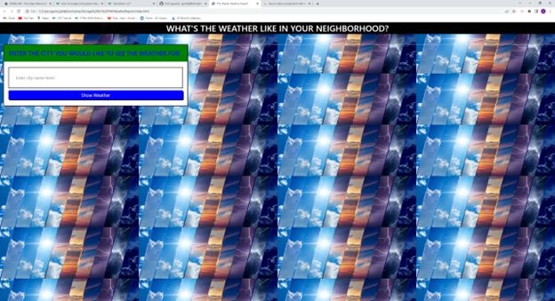

# WeatherReport
for this project i created a webpage that asked for a city and then pulled a 5 day weather forcast. I had to show my knowladge with local storage as well as showing an understanding of how to fetch apis and use them in the code. 

<>

file:///C:/Users/garre/gitlabbootcamp/Storage%20for%20HW/WeatherReport/index.html
https://garrettj94.github.io/WeatherReport/